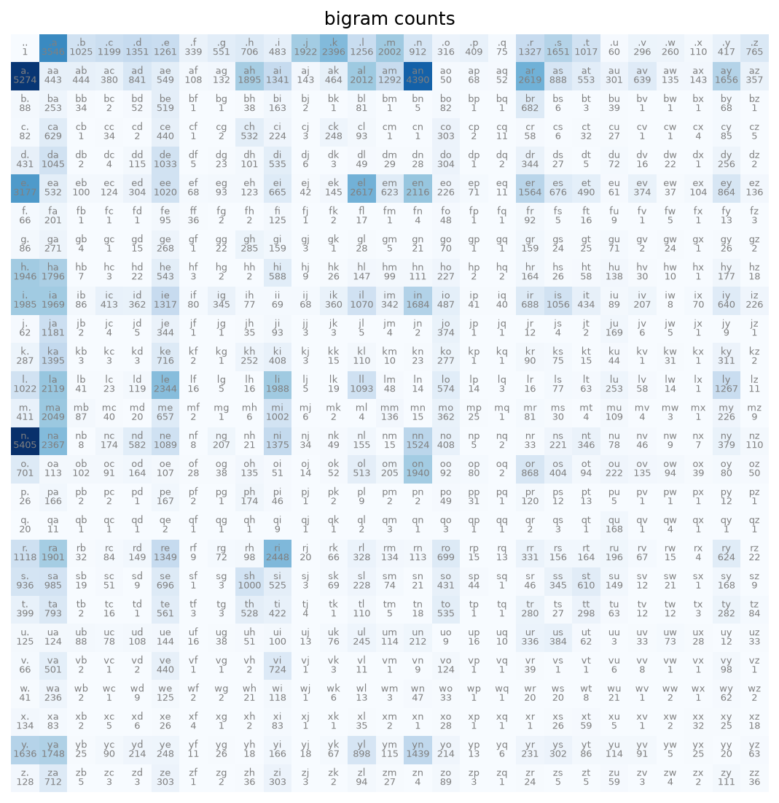
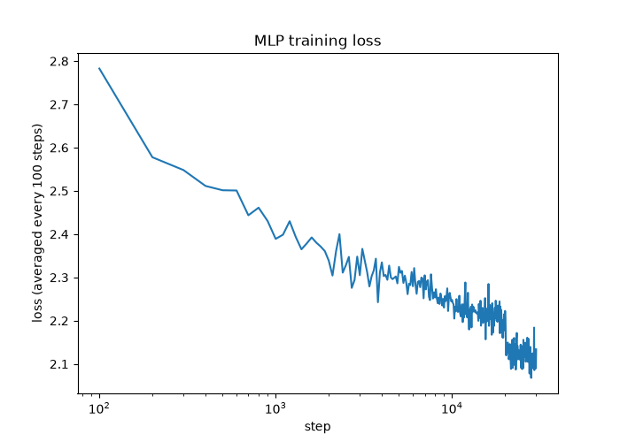

# makemore-clone

My own from-scratch build of Andrej Karpathy's [makemore](https://github.com/karpathy/makemore), the follow-up to my [micrograd-clone](https://github.com/azuriru3/micrograd-clone). It's a character-level language model that learns to generate new name-like strings after training on a list of real names.

Unlike micrograd, this one uses real PyTorch tensors instead of my own scalar `Value` engine. Building a tensor-level autograd engine from scratch first felt like a separate project on its own, so I picked up where the actual PyTorch API takes over.

## dataset

`data/names.txt` is a public domain list of about 32,000 first names, originally sourced from US Social Security Administration records. Same dataset used across a lot of tutorial implementations of this exercise.

## bigram model

The simplest possible version of this: just count how often each character follows each other character across the whole training set, normalize those counts into probabilities, and sample from them one character at a time.

```
python examples/train_bigram.py
```

```
train loss: 2.4548
dev loss:   2.4533
sampled names:
  anugeenvi
  s
  mabidushan
  stan
  ...
```

The loss here is the average negative log likelihood the model assigns to the real names, lower is better. 2.45 is genuinely not great, this model only ever looks at the single previous character, so it has no idea "anugeenvi" isn't a real name shape. Still produces something vaguely name-like some of the time, which is kind of the point, it's a baseline to beat.

Here's every bigram count in the training data, which is basically the entire model:



## MLP model

Instead of only looking at the single previous character, this one looks at the previous 3 (`block_size=3`), and instead of raw counts it learns a small embedding for each character plus a hidden layer on top, all trained with backprop and SGD like the MLP in micrograd-clone.

```python
from makemore.data import read_words, build_vocab, split_words, build_dataset
from makemore.mlp import MLP, generate
import torch

words = read_words('data/names.txt')
stoi, itos = build_vocab(words)
Xtr, Ytr = build_dataset(words, stoi, block_size=3)

g = torch.Generator().manual_seed(42)
model = MLP(vocab_size=len(stoi), block_size=3, generator=g)
loss = model.loss(Xtr, Ytr)
loss.backward()
```

Full training run:

```
python examples/train_mlp.py
```

```
final train loss: 2.1168
final dev loss:   2.1437
sampled names:
  emarkik
  analura
  vin
  deson
  shilvan
  aaryn
  ken
  ...
```

Train and dev loss land close together (2.12 vs 2.14), so it's not badly overfit, and both beat the bigram model's 2.45 by a decent margin. The names it generates are noticeably more name-shaped too, "shilvan" and "aaryn" look like something a person could plausibly be named, "anugeenvi" from the bigram model does not.



## structure

```
makemore/
  data.py  - vocab building, train/dev/test split, context-window dataset builder
  bigram.py - counting-based bigram model with laplace smoothing
  mlp.py    - the MLP model (embeddings + hidden layer) and its sampler
data/
  names.txt - the training data
tests/
  test_data.py
  test_bigram.py
  test_mlp.py
examples/
  train_bigram.py - trains and evaluates the bigram model, saves a heatmap
  train_mlp.py     - trains and evaluates the MLP, saves the loss curve
```

## running it

```
pip install -r requirements.txt
pytest tests/
python examples/train_bigram.py
python examples/train_mlp.py
```

## what I learned

*(filling this in later)*
